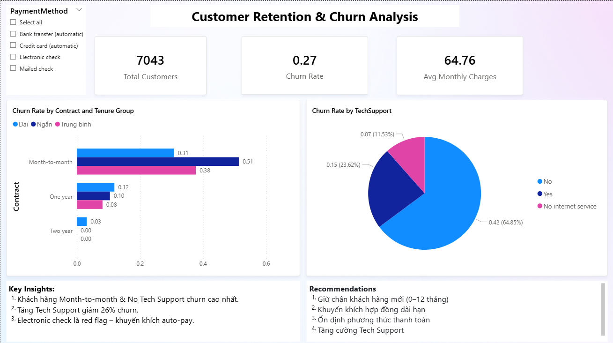

# 📂 Customer Retention & Churn Analysis

## 1. 📌 Project Overview

* **Tên dự án**: *Customer Retention & Churn Analysis*
* **Mục tiêu**: Phân tích hành vi khách hàng để xác định nhóm có churn cao, khám phá yếu tố ảnh hưởng chính và xây dựng mô hình dự đoán churn để hỗ trợ chiến lược giữ chân.
* **Thời gian**: 09/2025
* **Vai trò**: Cá nhân

---

## 2. 🎯 Business Problem

**Câu hỏi quản trị:**

1. Nhóm khách hàng nào có tỷ lệ churn cao nhất?
2. Những yếu tố nào ảnh hưởng mạnh mẽ nhất đến churn?
3. Doanh nghiệp cần làm gì để giảm churn và tối ưu retention?

---

## 3. 🛠️ Tools & Technologies

* **Python libraries**: pandas, numpy, matplotlib, seaborn, scikit-learn
* **Visualization**: matplotlib, seaborn
* **Other**: Excel (quick check, sanity check)

---

## 4. 📂 Data Source & Preparation

* Dataset: [Telco Customer Churn (Kaggle)](https://www.kaggle.com/blastchar/telco-customer-churn)
* Quy trình xử lý:

  * **Data Cleaning**: xử lý missing values, chuẩn hóa dữ liệu, encode biến categorical.
  * **Feature Engineering**: tạo biến `tenure_group`, one-hot encoding cho `Contract`, `PaymentMethod`, `InternetService`.

---

## 5. 📊 Analysis & Key Findings

### 🔍 Exploratory Data Analysis (EDA)

* **Tỷ lệ churn tổng thể**: \~26%.
* **Contract**: khách hàng Month-to-month có churn **42.7%**, cao gấp 4 lần so với One/Two year.
* **Tenure**: churn cao nhất ở nhóm mới (0–12 tháng) với **47.7%**.
* **Payment Method**: Electronic check có churn **45.3%** – cao nhất trong tất cả.
* **Internet Service**: Fiber optic churn **41.9%**, trong khi DSL chỉ 19%.
* **Tech Support**: Không có hỗ trợ kỹ thuật → churn **41.6%**, có hỗ trợ → chỉ **15.2%**.

### 🤖 Modeling (Predictive Analytics)

* **Logistic Regression**:

  * Xác suất churn cao tập trung ở nhóm khách hàng mới, chi phí cao, dùng fiber optic, trả bằng electronic check.

* **Random Forest Feature Importance**:

  * Top 5 yếu tố quan trọng:

    1. `TotalCharges` (tổng chi tiêu)
    2. `Tenure` (thời gian gắn bó)
    3. `MonthlyCharges` (chi phí hàng tháng)
    4. `PaymentMethod_Electronic check`
    5. `InternetService_Fiber optic`

---

## 6. ✅ Recommendations

1. **Giữ chân khách hàng mới (0–12 tháng)**

   * Onboarding tốt hơn, chăm sóc chủ động, khuyến mãi 3–6 tháng đầu.

2. **Khuyến khích hợp đồng dài hạn**

   * Giảm giá cho gói 1–2 năm, kèm thêm bundle dịch vụ.

3. **Cải thiện dịch vụ Fiber optic**

   * Điều tra nguyên nhân churn cao (giá, chất lượng, support).

4. **Ổn định phương thức thanh toán**

   * Khuyến khích auto-pay qua thẻ ngân hàng/credit card bằng ưu đãi nhỏ.

5. **Tăng cường Tech Support**

   * Cung cấp hỗ trợ 24/7, gói premium support miễn phí cho nhóm rủi ro cao.

6. **Ứng dụng mô hình dự đoán churn**

   * Tạo **churn risk score** → danh sách khách hàng có nguy cơ cao để ưu tiên giữ chân.

---

## 7. 🚀 Learning Outcomes

* Hiểu và áp dụng framework **Ask – Prepare – Process – Analyze – Share – Act**.
* Thực hành quy trình **end-to-end**: từ raw data → cleaning → phân tích → modeling → visualization.
* Phân tích được yếu tố ảnh hưởng đến churn bằng cả **EDA** và **Modeling**.
* Chuyển insight thành **business recommendation** thực tế.

